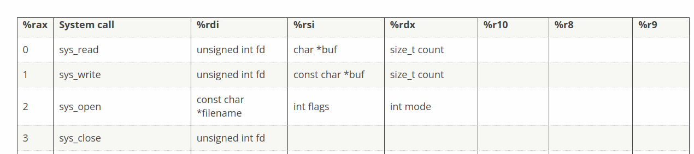

# ScratchVM - Lab 2
## Virtual Machine Application Execution

---

### 📋 Lab Overview

**Objective:** Run a simple Linux C application inside a micro virtual machine

**VM Configuration:**
- 1 vCPU
- Low amount of physical memory
- No devices (disk, network, peripherals)

---

## Step 1: Understanding VM Application Execution Flow

### 🔹 Task 1.1: Deploy and Run
```bash
$ cd lab2/vm_src
$ make app_img
$ make alll && make run
```

**Answer:**

    Output : 
        KVM_EXIT_HLT
        KVM_EXIT_HLT
        KVM_EXIT_HLT
        KVM_EXI^Cmake: *** [Makefile:16: run] Interrupt

    The KVM_EXIT_HLT corresponds to the system called in the function vmexit_handler( int exit_reason ). 
    The syscall is handled by syscall_handler() and in the boot.asm.
    Return value is the return value of the syscall handler.
    The infinite loop is mainly due to this part of the launch_vm() function :  
            while ( 1 ) {
                if ( ioctl( vcpufd, KVM_RUN, NULL ) == -1 )
                    err( 1, "KVM_RUN" );
                else
                {
                    if ( vmexit_handler( run->exit_reason ) == 0 )
                        break;
                }
            }
    

    Now we have a look at launch_vm() :
        First, we update the vCPU registers.
        Execution starts at boot. We then run the VM wuth KVM_RUN
    
    Real mode :
        CPU's initial 16-bit mode with no memory protection and no paging.

    Protected Mode :
        Enables segmentation, privilege levels, and memory protection.
    
    Long Mode :
        64-bit mode that supports 64-bit registers and virtual memory.

    GDT : 
        Global Descriptor tables. Defines memory segments used by the CPU.
    
    CR0 :
        Controls fundamental CPU features like protected mode and paging.
    
    CR4 :
        Enables advanced CPU features like PAE and SSE support.
    
    EFER :
        Special register used to enable long mode and syscall support.
    
    PAE :
        PAE allows the CPU to use extended page tables required for 64-bit mode.

    CR3 :
        CR3 stores the ph @ of the page table root.

### 🔹VM Execution Flow
    
    We will explain the VM's execution flow by explaining in details the main function in main.c.

    1- We create the VM : create_vm()
        This function get the KVM fd, get the KVM API version before creating the VM via an ioctl syscall.

    2- create_bootstrap( ) :
        This function creates the vCPU via an ioctl syscall.


**---------------------------------------------------------------------**


## Step 2: Handling VM Exits

### 🔹 Task 2.1: Explain VM Exits
**Question:** Explain the meaning of the VM exits

**Answer:**

    The KVM_EXIT_HLT corresponds to the system called in the function vmexit_handler( int exit_reason ). 
    The syscall is handled by syscall_handler() and in the boot.asm.
    Return value is the return value of the syscall handler.
    The infinite loop is mainly due to this part of the launch_vm() function :  
            while ( 1 ) {
                if ( ioctl( vcpufd, KVM_RUN, NULL ) == -1 )
                    err( 1, "KVM_RUN" );
                else
                {
                    if ( vmexit_handler( run->exit_reason ) == 0 )
                        break;
                }
            }


**---------------------------------------------------------------------**


### 🔹 Task 2.2: Identify Operations
**Question:** Identify and detail these operations
- Reference: [Linux System Call Table](https://blog.rchapman.org/posts/Linux_System_Call_Table_for_x86_64/)

**Answer:**

    Operations :

        

        1- int fd = open( FILENAME , O_RDWR | O_CREAT , 0777 ) :
            syscall #2
                The open() system call opens the file specified by path.  If the specified file does not exist, 
                it may optionally ( if O_CREAT is specified in flags ) be created by open() .
                The return value of open() is a file descriptor, a small, non negative integer.
        
        2- write( fd , buff_1 , strlen( buff_1 ) ) ;
            syscall #1
                write() writes up to count bytes from the buffer starting at buf_1 to the file referred to by the file descriptor fd.

        3- close( fd ) ;
            syscall #3
                close() closes a file descriptor, so that it no longer refers to any file and may be reused.

        4- exit() ;
            syscall #60
                The exit() function causes normal process termination and the
                least significant byte of status (i.e., status & 0xFF) is returned
                to the parent (see wait(2)).


    


**---------------------------------------------------------------------**


### 🔹 Task 2.3: Handle Operations
**Question:** Handle the operations performed by the VM application

**Answer:**


**---------------------------------------------------------------------**


## Step 3: Reverse Engineering

### 🔹 Task 3.1: Guess Source Code
**Question:** Try to guess the source code of the VM application

**Answer:**


**---------------------------------------------------------------------**


### 📝 Additional Notes

